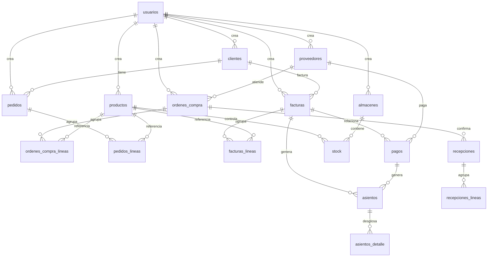

# ERP Manufactura Honduras (HNL) - Documentación

## 1. Alcance

ERP orientado a manufactura ligera en Honduras (idioma español, moneda HNL) cubriendo contabilidad,
inventario, CRM básico, proveedores, compras, ventas y facturación electrónica.

Roles soportados: Administrador, Contador, Ventas, Compras, Almacén, Auditor.

## 2. Requerimientos no funcionales

- Autenticación JWT + RBAC.
- Auditoría y logs estructurados.
- p95 de respuesta API < 300 ms mediante PostgreSQL + índices.
- Escalabilidad horizontal con Docker/K8s.
- Backups automáticos y pruebas automatizadas (Vitest y React Testing en roadmap).

## 3. Diagrama ER (Mermaid)



## 4. Flujos BPMN (texto)

### Compras
1. RFQ -> OC (aprobación automática si monto <= HNL 100,000; si excede requiere Administrador).
2. Recepción valida cantidades y actualiza `stock`/`kardex` via procedimiento `registrar_ajuste_inventario`.
3. Factura proveedor crea CxP con retenciones configurables (ISV acreditable 15% / 18%).
4. Pago ejecuta conciliación bancaria y asiento contable.

### Ventas
1. Cotización -> Pedido (valida crédito y disponibilidad en `stock`).
2. Picking/Salida genera movimiento y actualiza Kardex.
3. Factura electrónica genera documento SAR, impuestos por línea e integra asiento contable.
4. Cobro registra aplicación parcial/total y aging CxC.

### Inventario
1. Conteo cíclico -> Ajuste -> Revalorización (opcional) con asiento automático.
2. Movimientos soportan entradas, salidas y transferencias entre almacenes.

### Contabilidad
1. Integración automática desde compras/ventas/inventario.
2. Cierre mensual genera provisiones y depreciaciones (activos fijos en roadmap).
3. Estados financieros disponibles en PDF/Excel.

## 5. Seguridad y Cumplimiento

- RBAC por rol/permisos definidos en `permissions.ts`.
- Auditoría vía middleware `auditTrail` + tabla `auditoria`.
- Hash comprobantes, control de numeración fiscal.
- Cumplimiento SAR para factura electrónica hondureña, retenciones ISV/ISR y Ley de Protección de Datos.

## 6. API REST

- Base `/api/v1` con paginación, filtros y rate limiting.
- Autenticación `Bearer`.
- Endpoints para catálogos, inventario, compras, ventas, facturación, contabilidad y reportes.
```
GET /api/v1/catalogos/clientes
POST /api/v1/compras/ordenes
POST /api/v1/facturacion/facturas
GET /api/v1/reportes/cartera
```

## 7. Backlog próximo

- Integración SAT (timbrado) con pruebas unitarias.
- Motor de workflows configurables.
- Automatización de pruebas end-to-end (Playwright).

## 8. Recursos adicionales

- [Guía de pruebas con Postman](./postman-pruebas.md)
- [Datos de ejemplo en SQL](./documentos-ejemplo.sql)
